# ECE 172A - Winter 2022
This repo contains Python scripts exploring various aspects of pathfinding, machine intelligence, and robotic kinematics. All scripts can be run and customized by cloning this repo and modifying any initial conditions.

## Potential Field Traversal

  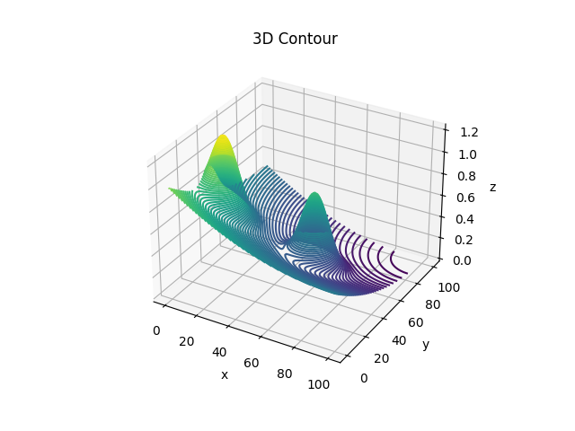

Potential_Field_Traversal.py explores gradient descent as a method of robotic traversal. Real-world obstacles are represented as hills(repulsors) and the objective is represented by a hole(attractor) that encompasses the entire space. The robot can be placed anywhere in the room and will have a natural tendency to descend towards the objective. This algorithm mimics the effects of gravity on objects and the hills created by obstacles will cause the robot to roll around them as it descends. This method of traversal is better than the sense-act traversal method because it allows path planning before beginning to move. Sensing and acting on the fly can get you stuck or produce a suboptimal path. 

### 1 Plotting the Potential and Vector Fields

  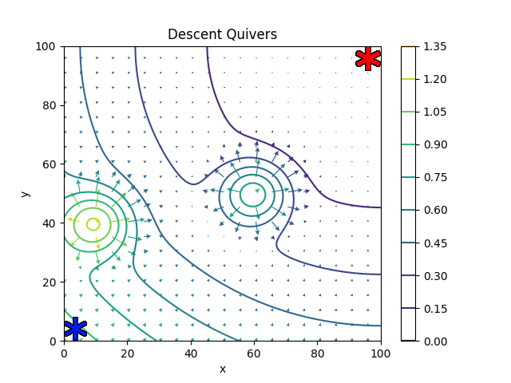

The starting position is at [0,0], the goal is at position[99, 99], and the obstacles are located at [10,40] and [60, 50].
Real-world obstacles are represented as repulsors in the potential field. This adds gradients to the plot where the objects are and will cause the bot to move around them when performing gradient descent. 

### 2 Applying gradient descent and plotting bot position at every iteration

  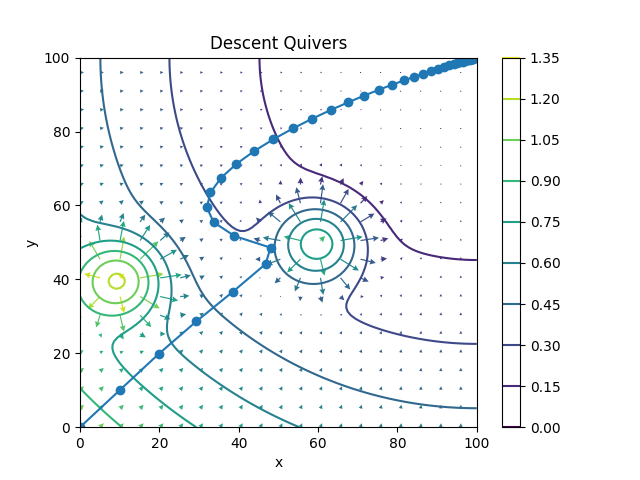

### 3 Changing the initial position of the bot and running gradient descent

  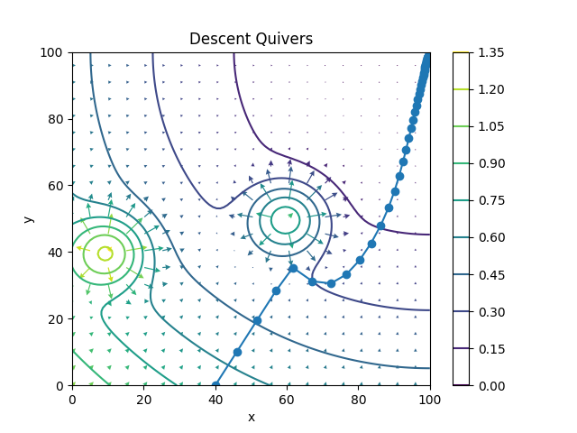

### 4 Changing obstacle positions and running gradient descent

  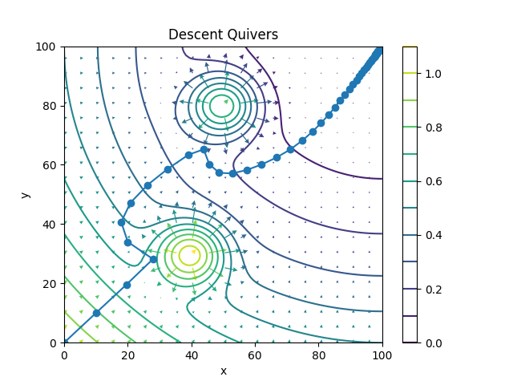

## Robot Swarms

  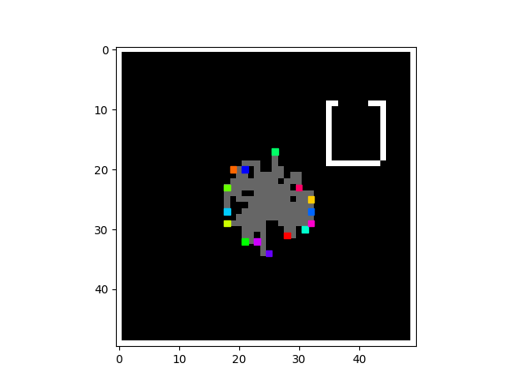

Robot_Swarm.py generates N robots on an MxM map for them to explore. Positions on the map can either be labeled as unmapped, planned, mapped, or wall. All bots share the same destination selection algorithm and utilize A* search to find a path. The bots keep track of all explored areas and continue exploring until all positions have been mapped. The goal of the algorithm is not to keep the swarm together but instead explore the map in the fewest iterations possible. In order to prevent robots from moving in a clump and walking the same path, a list of the closest positions is kept and a random option is chosen.

### 1 Map exploration with 5 Robots

  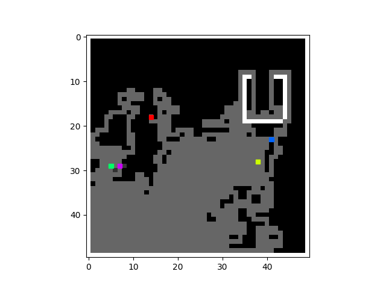

Performance with 5 robots was 629 iterations

### 2 Map exploration with 10 Robots

  

Performance with 10 robots was 343 iterations

### 3 Map exploration with 15 Robots

  

Performance with 15 robots was 249 iterations

## Path Finding

  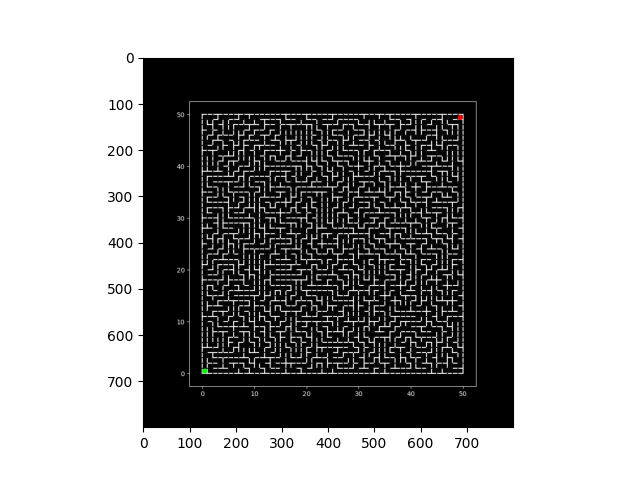

Path_Finding.py implements two basic search algorithms, Breadth First Search (BFS) and Depth First Search (DFS). BFS searches through all of the starting node's children, updates their parent variable to the current node, and adds them to the stack. Then BFS pops the node at the front of the stack (FIFO) and adds all of its children to the stack. This process is repeated until the goal is reached. Then the path is extracted by starting at the end and following all of the parent pointers. DFS is similar to BFS except it pops from the top of the stack (LIFO). Performance between the two implementations is decided via for-loop iterations.

### 1 Breadth-first search

  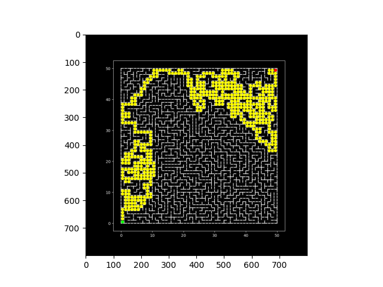

Performance for BFS was 1,258 iterations.

### 1 Depth-first search

  

Performance for DFS was 2,487 iterations. Even though the resulting path for both algorithms is the same, DFS was the least efficient of the two.

## Robot Kinematics
Robot_Kinematics.py is a tool that allows you to input a robot arm's segment lengths, starting angles, and desired target position. The algorithm will then calculate the inverse jacobian of the current position and destination to move the joints one step closer to the goal. These steps are stored and then animated once the target is reached.

### 1 Inverse kinematics

  

Final robot arm position given target (6,2), initial joint angles θ1=π/6, θ2=0, θ3=0, and arm lengths L1=L2=L3=10

  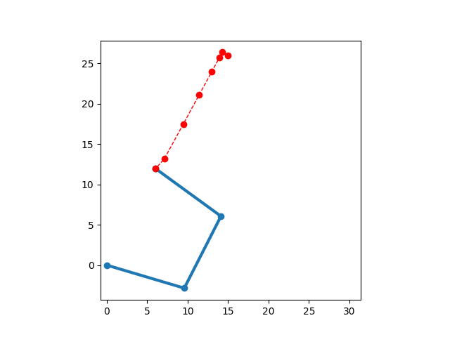

Final robot arm position given target (6,2), initial joint angles θ1=π/3, θ2=0, θ3=0, and arm lengths L1=L2=L3=10

### 2 Forward kinematics

  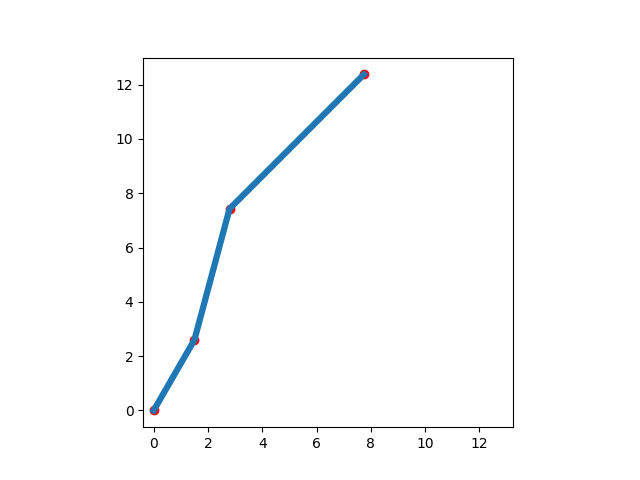

Robot arm given joint angles θ1=π/3, θ2=π/12, θ3=−π/6 and arm lengths L1=3, L2=5, L3=7

  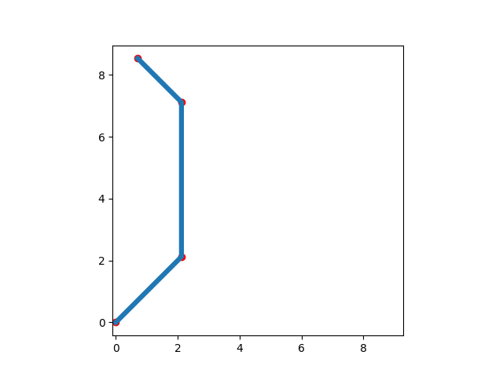

Robot arm given joint angles θ1=π/3, θ2=π/12, θ3=−π/6 and arm lengths L1=3, L2=5, L3=7
